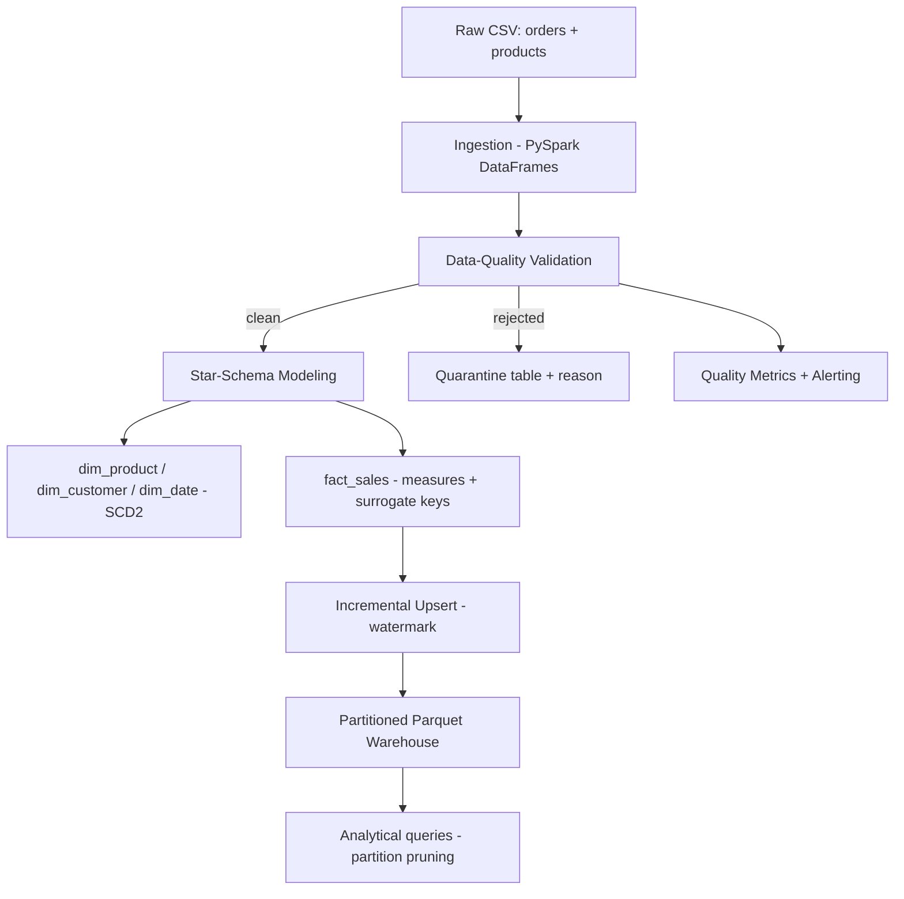
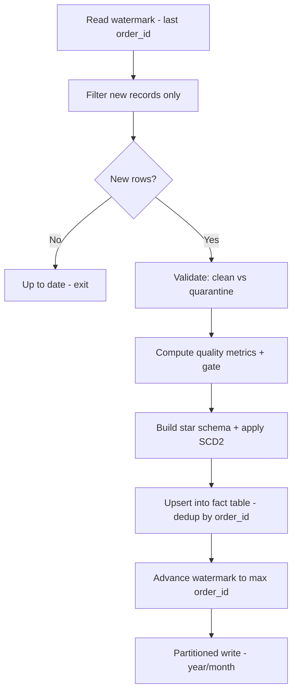

# DataForge — Big-Data Processing & Cloud Warehouse Pipeline

**DataForge** is an end-to-end data pipeline built with **Python** and **Apache Spark (PySpark)**. It ingests raw retail data, validates it through data-quality gates, models it into a **star-schema data warehouse** with **SCD Type 2** history, and loads it **incrementally** with upsert semantics — with partition-based query optimization, data-quality metrics/alerting, and an Airflow orchestration definition. It demonstrates the core patterns of production data engineering.

## Motivation

Analytical systems must turn raw, high-volume, messy data into query-optimized warehouse schemas reliably and repeatably. DataForge implements the full workflow — ingestion, distributed transformation, data-quality enforcement, dimensional modeling with history, incremental loading, and partition optimization — the way production pipelines do.

## Key Features

- **Distributed processing with PySpark** — runs locally in `local[*]` mode (simulated cluster) and scales to a real cluster unchanged.
- **Data-quality validation** — null, range, and referential-integrity checks; bad rows are **quarantined** with a reject reason instead of failing the batch or corrupting analytics.
- **Data-quality metrics + alerting** — per-batch rejection rate and per-reason breakdown, with a configurable quality gate that alerts when the rejection rate exceeds a threshold.
- **Star-schema dimensional modeling** — a central `fact_sales` table with **surrogate foreign keys** to `dim_product`, `dim_customer`, and `dim_date`, plus computed measures (quantity, revenue).
- **SCD Type 2 dimension history** — when a tracked attribute changes, the old dimension row is expired (with an expiry date) and a new current version is inserted, preserving point-in-time history.
- **Incremental loading** — a **watermark** tracks the last processed record so each run only handles the delta; new fact rows are **upserted** (update-or-insert), making re-runs **idempotent**.
- **Partition-based optimization** — the fact table is partitioned by year/month, enabling **partition pruning** (verified in the physical plan).
- **Airflow orchestration** — the pipeline is defined as a scheduled, retrying, dependency-ordered DAG.
- **Tested** — validation rules, dimensional modeling, incremental upsert, SCD Type 2, and quality metrics.

## Architecture



## Pipeline Flow



## SCD Type 2 Example

When customer C001 moves from Austin to Denver, history is preserved:

```
customer_key | customer_id | city   | effective_date | expiry_date | is_current
1            | C001        | Austin | 2026-01-01     | 2026-06-01  | false
2            | C001        | Denver | 2026-06-01     | (null)      | true
```

Historical fact rows still map to the Austin version; new rows map to Denver.

## Star Schema

```
   dim_product              dim_date
   (product_key PK,         (date_key PK,
    product_id, name,        date, year,
    category, unit_price)    month, day)
          \                   /
           \                 /
            +--> fact_sales <--+
                 (order_id,
                  product_key FK,
                  customer_key FK,
                  date_key FK,
                  quantity,     -- measure
                  revenue)      -- measure
                     |
              dim_customer (SCD2)
              (customer_key PK,
               customer_id, city,
               effective_date, expiry_date, is_current)
```

## Project Structure

```
dataforge/
├── main.py                     # pipeline entry point (incremental)
├── optimize_demo.py            # partitioning + partition-pruning demo
├── requirements.txt
├── data/generate_data.py       # sample data generator (incl. bad rows)
├── ingestion/ingest.py         # CSV -> Spark DataFrames
├── quality/
│   ├── validate.py             # data-quality rules + quarantine
│   └── metrics.py              # quality metrics + threshold alerting
├── modeling/
│   ├── star_schema.py          # fact + dimension builders (surrogate keys)
│   └── scd.py                  # SCD Type 2 dimension history
├── load/
│   ├── watermark.py            # incremental checkpoint
│   └── incremental.py          # delta filter + upsert + partitioned write
├── etl/spark_session.py        # configured local SparkSession
├── dags/dataforge_dag.py       # Airflow orchestration DAG
└── tests/                      # validation, modeling, incremental, SCD2, metrics
```

## Build & Run

### Prerequisites
- Python 3.11+ and Java 17+ (for Spark)

### Setup
```bash
python3 -m venv venv
source venv/bin/activate
pip install -r requirements.txt
```

### Run the pipeline
```bash
python data/generate_data.py     # generate sample retail data
python main.py                   # incremental ETL: ingest -> validate -> model -> upsert
python optimize_demo.py          # partitioning + partition-pruning demo
python -m pytest tests/ -v       # run tests
```

## Design Decisions

**PySpark for distributed processing** — DataFrames give a lazily-evaluated, distributed abstraction; the same code runs on a laptop or a cluster by changing the master URL.

**Quarantine over hard failure** — Bad rows are diverted to an error table with a reason rather than failing the whole batch, so one malformed record never blocks a load or silently corrupts analytics.

**Quality metrics + gate** — Each batch's rejection rate and per-reason breakdown are computed; exceeding a threshold raises an alert, catching upstream data problems before they reach the warehouse.

**Star schema with surrogate keys** — Surrogate keys insulate the warehouse from source-system ID changes; the star layout makes analytical joins fast and BI-tool-friendly.

**SCD Type 2 for dimension history** — Attribute changes create a new versioned row rather than overwriting, so historical facts always map to the correct point-in-time attributes. (For very large dimensions, a Delta Lake MERGE would replace the collect-based approach — see Roadmap.)

**Incremental loading + idempotent upsert** — A watermark limits each run to the delta; upsert (union + dedup-by-latest keyed on `order_id`) makes re-runs idempotent and retries safe — the difference between minutes and hours at scale.

**Partitioning for pruning** — Partitioning the fact by year/month lets the query planner skip irrelevant partitions (`PartitionFilters` in the physical plan), drastically reducing scan cost for time-filtered queries.

**Parquet output** — A columnar on-disk format optimized for the read-heavy analytical queries a warehouse serves.

## Roadmap
- Delta Lake backend for native ACID MERGE + time travel (scales SCD2 to large dimensions)
- Cloud warehouse target (Snowflake / BigQuery / Redshift)
- Streaming ingestion (Structured Streaming) alongside batch

## License
MIT

---
